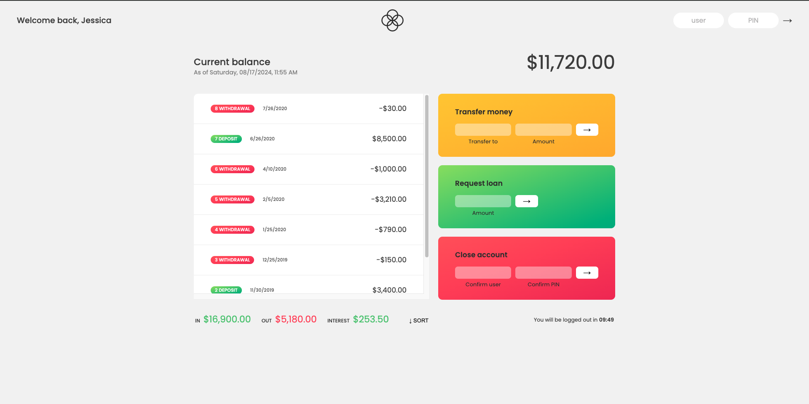

# Bankist Account Project




The Bankist Account project is part of Jonas Schmedtmann’s course section on Numbers, Dates, and Timers. This project focuses on building a banking application that handles user accounts, transactions, and various financial operations with real-time updates. It demonstrates how to work with numbers, dates, and timers in JavaScript.

## Key Features

- **User Accounts**: Allows users to create and manage their bank accounts.
- **Transaction History**: Users can view a detailed history of their transactions.
- **Account Balance**: Displays the current balance of the user's account.
- **Loan Requests**: Users can request loans and see simulated loan processing.
- **Timer**: Implements a logout timer to automatically log out users after a period of inactivity.
- **Date Formatting**: Formats dates and times to show user-friendly information.

## Flowchart


## Technologies Used

- **HTML/CSS**: For structuring and styling the application interface.
- **JavaScript**: For implementing interactive features and handling business logic.
- **Date and Time Functions**: Utilizes JavaScript’s `Date` object and related functions for managing and displaying dates and times.
- **setTimeout and setInterval**: For implementing timers and periodic updates.
- **ESLint**: For maintaining code quality and consistency.
- **Prettier**: For automatic code formatting.

## Learning Objectives

- **Handling Dates and Times**: Learn how to work with dates and times in JavaScript using the `Date` object.
- **Timers**: Understand how to use `setTimeout` and `setInterval` for timing functionalities and periodic updates.
- **Number Formatting**: Gain experience in formatting numbers to display currencies and other financial data.
- **Real-Time Updates**: Implement real-time updates to reflect changes in user accounts and transactions.

## Getting Started

1. **Clone the Repository**: 

    ```bash
    git clone https://github.com/WMFK98/Bankist-Accounting
    ```

2. **Navigate to the Project Directory**: 

    ```bash
    cd Bankist-Account
    ```

3. **Start the Development Server**: 

    ```bash
    npx live-server
    ```

4. **Open Your Browser**: Visit `http://localhost:3000` to view the app.

## Contributing

Contributions to the Bankist project are welcome! If you have suggestions or improvements, please create a pull request or open an issue.

For more details and to see the full course, check out Jonas Schmedtmann’s course on [Udemy](https://www.udemy.com/course/advanced-css-and-sass/).
